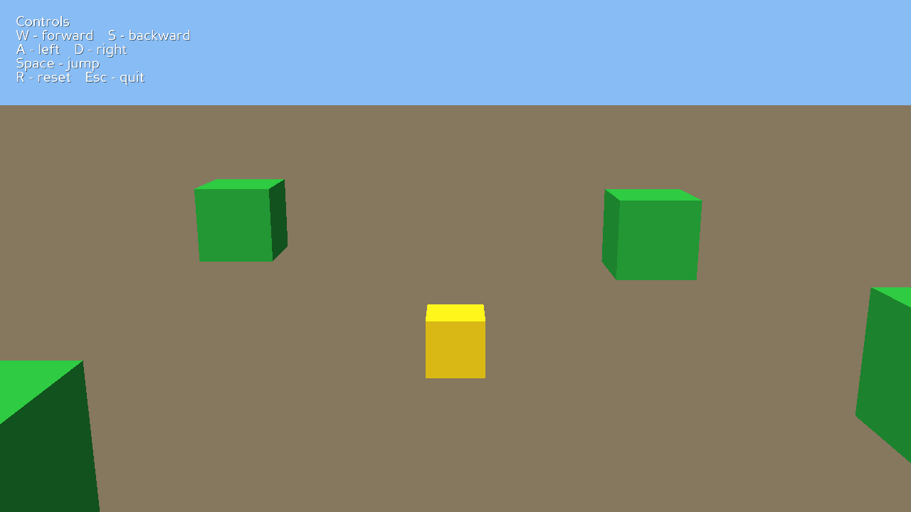
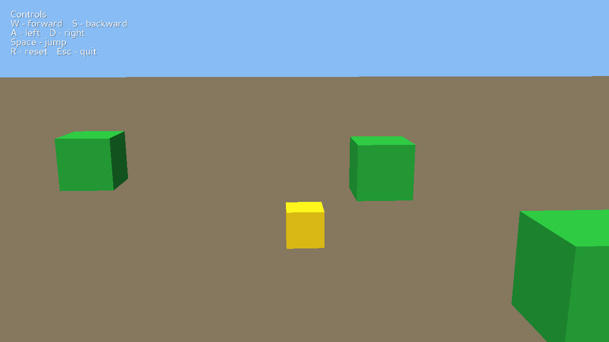
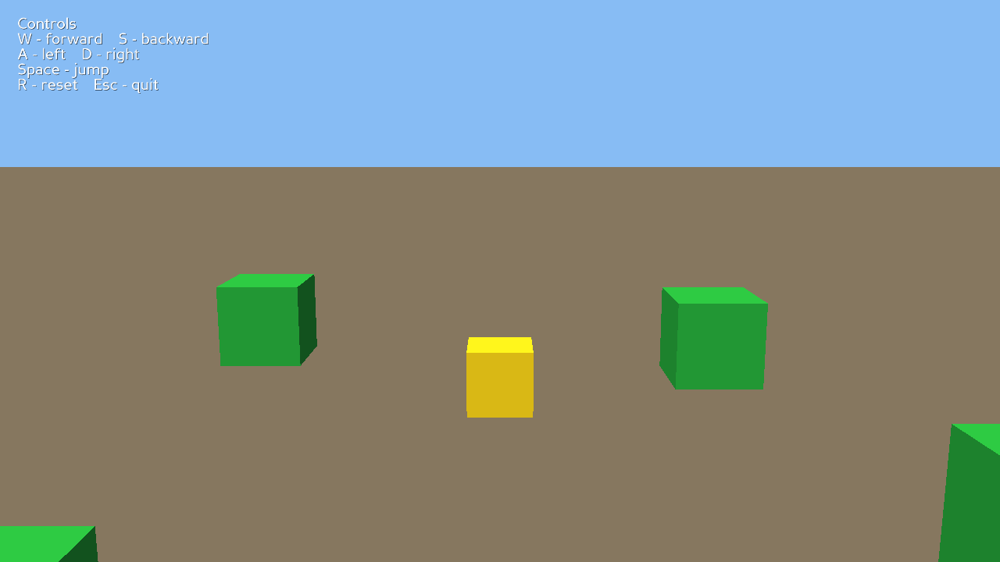
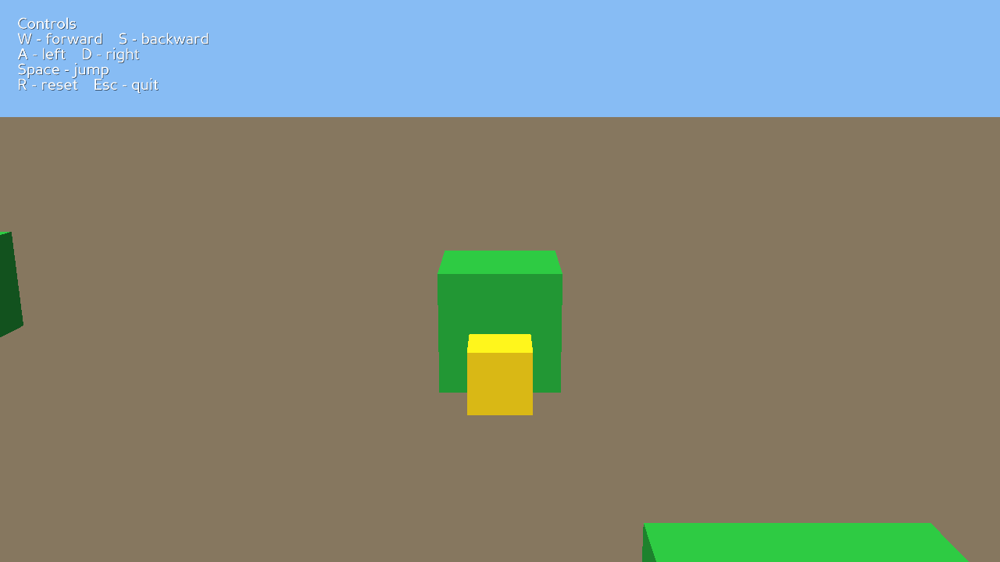
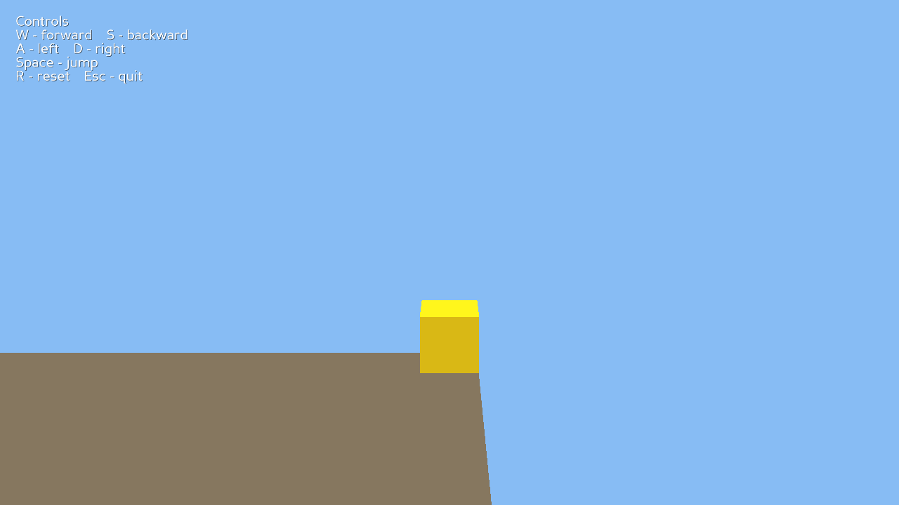

# Cube Character in a 3D World

[](https://github.com/Elia-Youssef/panda3d-cube-character-in-3d-world/actions/workflows/ci.yml)

A compact third-person movement template built with Panda3D. Guide a yellow cube
through a lit procedural world, build speed smoothly, jump under gravity, collide
with green obstacles, and explore the bounded ground plane with a follow camera.

The project is asset-self-contained. Every runtime visual is generated in Python
from procedural geometry, flat colors, lighting, and Panda3D's built-in text. It
does not load external models, textures, audio, fonts, or network resources.



## Features

- Smooth velocity-based WASD movement with acceleration and deceleration.
- Grounded Space-bar jumping with gravity and no mid-air double jump.
- Reliable floor, obstacle, obstacle-top, and world-boundary collision.
- Four green procedural obstacle cubes and a yellow procedural player cube.
- A fixed-orientation third-person camera that follows behind and above the player.
- A directional sun light with ambient fill and a plain procedural sky box.
- Reset-safe tasks, input handlers, collision objects, scene nodes, and HUD elements.
- Bounded physics substeps that keep movement and collision stable at low frame rates.

## Requirements

- Python 3.13.3
- Panda3D 1.10.16

These are the verified development and test versions. `panda3d==1.10.16` is the
only non-standard runtime dependency. Other Python and Panda3D versions have not
been validated for this project.

## Installation

Clone the repository and enter its directory:

```text
git clone https://github.com/Elia-Youssef/panda3d-cube-character-in-3d-world.git
cd panda3d-cube-character-in-3d-world
```

Create a virtual environment:

```text
python -m venv .venv
```

Activate it on Windows PowerShell:

```text
.\.venv\Scripts\Activate.ps1
```

Or activate it on macOS or Linux:

```text
source .venv/bin/activate
```

Install Panda3D:

```text
python -m pip install -r requirements.txt
```

## Run

Launch from the directory containing `main.py`:

```text
python main.py
```

The game opens in a 1280x720 window. The normal play state has no timer or end
screen, so you can move, jump, test collisions, and reset for as long as you like.

## Controls

| Input | Action |
|---|---|
| W | Move forward, away from the camera |
| S | Move backward, toward the camera |
| A | Move left |
| D | Move right |
| Space | Jump while grounded |
| R | Reset position, velocity, inputs, and camera |
| Escape | Exit cleanly |

Movement uses world axes under a fixed camera orientation, so the controls remain
visually aligned with the view: W is screen-forward, S is backward, A is left,
and D is right. Diagonal input is normalized to avoid moving faster diagonally.

## Gameplay and physics

The cube eases toward a target velocity instead of snapping to full speed. When
input is released, it decelerates smoothly to a stop. Gravity runs continuously,
and Space applies an upward velocity only while the player is grounded.

Obstacle sides block horizontal movement, while a separate downward collision ray
finds the ground or an obstacle top. The visible ground also has an invisible edge
boundary, so the player cannot walk into empty space. Physics uses short substeps
and consumes the elapsed frame time, keeping movement, gravity, jumping, camera
follow, and collision consistent from high frame rates down to tested low rates.

## Screenshots

| Smooth movement | Jump under gravity |
|---|---|
|  |  |

| Obstacle contact | World boundary |
|---|---|
|  |  |

## Project structure

```text
main.py                 Panda3D application, input, HUD, camera, and update task
config.py               Window, palette, physics, camera, and collision constants
geometry.py             Procedural box geometry, sky, lights, and camera setup
world.py                Ground, sky, lighting, obstacles, and collision solids
player.py               Movement, jumping, gravity, floor and wall collision
Config.prc              Window size, title, multisampling, and null audio backend
requirements.txt        Intentional Panda3D runtime version pin
.gitignore              Local Python, environment, build, and editor exclusions
docs/images/            Curated public gameplay screenshots
tests/                  Static, logic, smoke, window, and screenshot checks
.github/workflows/      Continuous integration workflow
.editorconfig           Cross-editor formatting defaults
.gitattributes          Text and binary file handling
LICENSE                 MIT License
README.md               Setup, gameplay, verification, and project notes
```

## Automated verification

Run every non-graphical suite with one command from the repository root:

```text
python -B tests/run_all.py
```

The individual commands are:

```text
python -B tests/test_static.py
python -B tests/test_logic.py
python -B tests/smoke_launch.py
```

The static suite checks source structure, dependency and procedural-asset rules,
input and collision wiring, text hygiene, and the protected entry point. The logic
suite boots the real application offscreen and exercises event-driven controls,
acceleration, gravity, jump and landing, all obstacle faces, obstacle tops, ground
and world bounds, camera follow, low-frame-rate behavior, and repeated-reset leak
counts. The smoke suite constructs, steps, and shuts down the application cleanly.

Run the visible scripted window check separately:

```text
python -B tests/onscreen_run.py
```

Generate a new visual-review set without overwriting earlier evidence by choosing
a directory name that does not already exist:

```text
python -B tests/capture.py --output-dir tests/_screens/manual-review-2
```

## Manual stability checklist

1. Hold and release W, A, S, and D separately, then diagonally. Confirm smooth
   acceleration, correct direction, normalized diagonal speed, and deceleration.
2. Press Space from the ground and confirm a complete jump arc and landing. Confirm
   Space cannot trigger a second jump while airborne.
3. Run into every side and corner of each green obstacle. Confirm the yellow player
   stops without tunneling and can navigate around the cube.
4. Land on an obstacle top, walk off, and confirm the player returns to the ground.
5. Walk to the edge of the visible slab and confirm the world boundary stops motion.
6. Move and jump while watching the chase camera. Confirm it remains behind and
   above the player and the sky stays visible.
7. Press R during movement and during a jump, then repeat it many times. Confirm the
   player, velocity, held inputs, and camera reset without duplicate scene objects.
8. Confirm the HUD remains readable at 1280x720 and after resizing the window.
9. Press Escape and confirm the window closes without a traceback or lingering task.

## Assets and originality

All runtime geometry, interface text, colors, and scene composition are authored in
the source code. The project contains no third-party runtime models, textures,
audio, fonts, animations, logos, or network-loaded content. Images under
`docs/images/` are reviewed screenshots of this procedural project and are not
runtime dependencies.

## Scope and limitations

This is an intentionally small desktop movement template. It does not include
combat, enemies, scoring, collectibles, objectives, victory or defeat states,
camera rotation, animation, audio, multiplayer, saving, loading, or multiple
levels. The fixed world and placeholder cube character are designed as a clean
foundation for adding those systems later.

## License

This project is available under the [MIT License](LICENSE).
